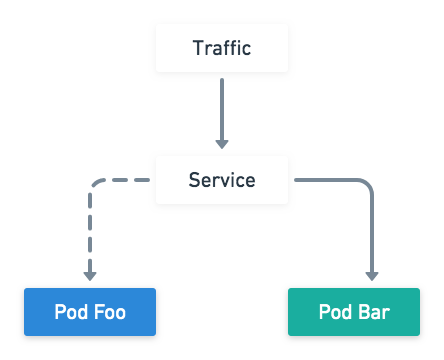

# Hands-on 1

## Pod 

建立兩個 Pod 分別實現以下描述之功能

* Pod image: ``

* foo: 限制資源使用率
    * CPU 50Mi Memory 100Mi
    * Label: `podname=foo, deployment=blue`

* bar: 實現服務健康探針偵測
    * liveness endpoint 為 `/healthz`
    * readiness endpoint 為 `/able-to-serve`
    * Label: `podname=bar, deployment=green`
    
並且兩個 Pod 分別利用 Node Selector 部署至不同節點

## Service

首先流量指定到 Pod foo 確認成功後，透過調整 Service labels 將流量導向至 Pod bar
