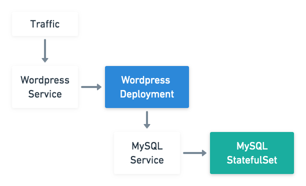

# Hands-on 2

## Deployment

建立一個 Deployment，並且透過 Downward API 將 pod 相關資訊放置到 nginx web path

* Image: `tachingchen/nginx-test:0.1`
* NGINX web path: `/usr/share/nginx/html`
* downwardAPI: https://kubernetes.io/docs/tasks/inject-data-application/downward-api-volume-expose-pod-information/

## DaemonSet

建立一個 NGINX DaemonSet，由於 NGINX 會將 access log 寫到 `/var/log/nginx/`

請外掛 `hostPath` volume 至 `/var/log/nginx/`，確保 Pod 死掉重啟後能保留

* Image: `tachingchen/nginx-test:0.1`
* NGINX log path: `/var/log/nginx/`
* hostpath: https://kubernetes.io/docs/concepts/storage/volumes/#hostpath

## StatefulSet

利用下方資訊建立如上圖所示之 Stateful Application

1. Wordpress
  * Image: `wordpress:4.8-apache`
  * Web port: `80`
  * 環境變數:
    * `WORDPRESS_DB_HOST`: 資料庫位址
    * `WORDPRESS_DB_PASSWORD`: 資料庫密碼

2. MySQL
  * Image: `mysql:5.6`
  * DB port: `3306`
  * db 資料存放位置: `/var/lib/mysql`
  * 環境變數:
    * `MYSQL_ROOT_PASSWORD`: 資料庫密碼
